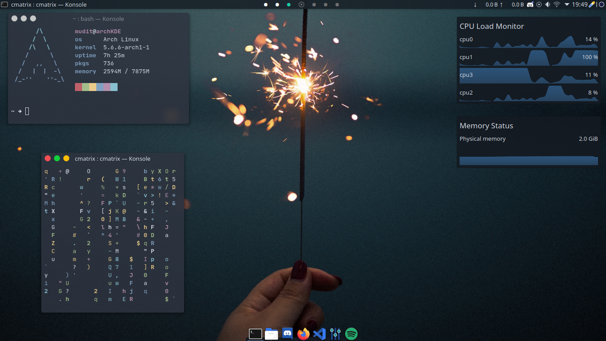
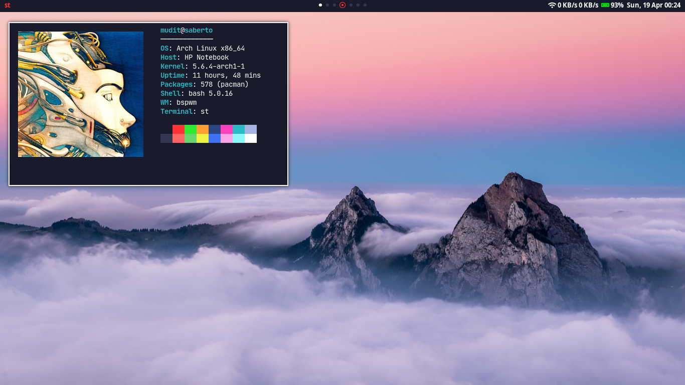
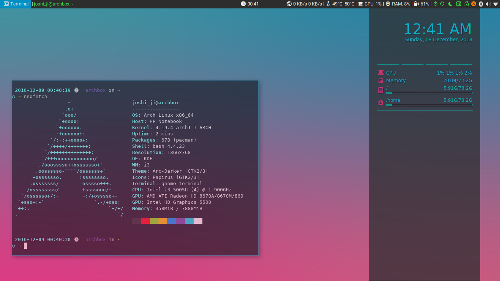

# dotfiles

A little collection of my 🐧nix dot files

## Setup

Use GNU Stow for setting up configurations...
* cd to home directory : `cd ~`
* clone this repository: `git clone https://github.com/muditjoshi98/dotfiles`
* cd to dotfiles : `cd dotfiles`
* then cd to setup you want : `cd arch+bspwm` (or and other setup)
* `stow bspwm` (or any other folder whom config you want)

More details on stow refer to [this blog](https://alexpearce.me/2016/02/managing-dotfiles-with-stow/). 

**OR you can simply copy paste**

All the wallpapers I have used, you can get [from here](https://drive.google.com/drive/folders/1pjaxknbXa_p5t8X4umXg75J3bc2I36Au?usp=sharing)

## Screenshots

### Arch + KDE

### Arch + BSPWM

### Old ones

