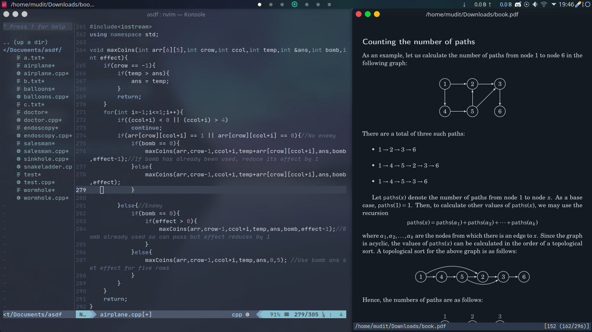
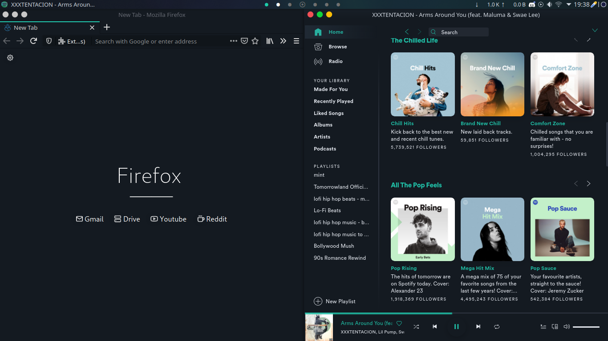

# Arch + KDE

Here it goes:
* **Distro** : Arch Linux
* **DE** : KDE
* **Shell** : bash
* **Wallpaper** : Sparkles
* **Color Scheme** : Aritim-Dark
* **Terminal Color Scheme** : Nord
* **Spotify Theme** : Spicetify
* **Bar and Dock** : Latte Dock
* **Programs** : [Neovim](https://github.com/neovim/neovim/), [Zathura](https://pwmt.org/projects/zathura/), [cmatrix](https://github.com/abishekvashok/cmatrix), firefox, spotify
* **Fonts** : JetBrains Mono (Terminal), Noto Sans (System)

For easy installation you can use [Stow](https://www.gnu.org/software/stow/)

For more details on installation and program setup refer my [ArchDocs](https://github.com/muditjoshi98/ArchDocs)

### Few more screenshots

<h4 align=center>
   
  NeoVim, Zathura  
   
  Firefox and Spotify
</h4>

