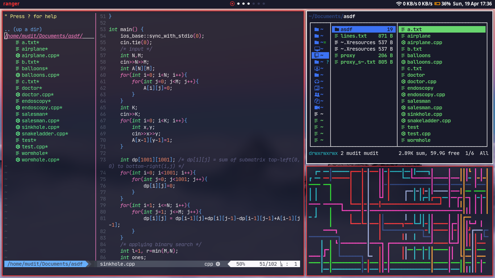
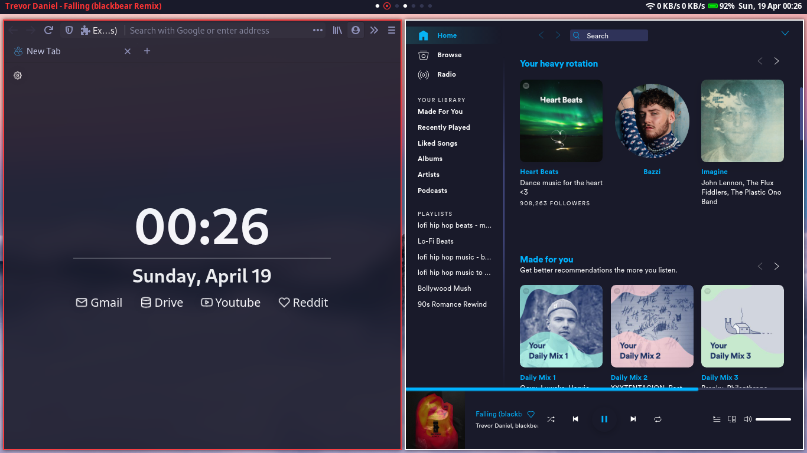

# Arch + BSPWM

Here are some details about my setup:
* **WM:** [bspwm](https://github.com/baskerville/bspwm)
* **OS:** Arch Linux
* **Shell:** bash
* **Terminal:** [st](https://st.suckless.org/)
* **Editor:** [Neovim](https://github.com/neovim/neovim/)
* **File Manager:** [Ranger](https://github.com/ranger/ranger)
* **Launcher:** [rofi](https://github.com/davatorium/rofi/)
* **Bar:** [Polybar](https://github.com/polybar/polybar)
* **Browser:** Firefox
* **Doc Viewer:** [Zathura](https://pwmt.org/projects/zathura/)
* **Notification Daemon:** [dunst](https://dunst-project.org/)
* **X11 Compositor:** [picom(tryone's fork)](https://github.com/tryone144/picom/)

For easy installation use [Stow](https://www.gnu.org/software/stow/)

For more details on installation and program setup refer my [ArchDocs](https://github.com/muditjoshi98/ArchDocs)

### Few more screenshots

<h4 align=center>
   
  NeoVim, Ranger and pipes.sh  
   
  Firefox and Spotify
</h4>

