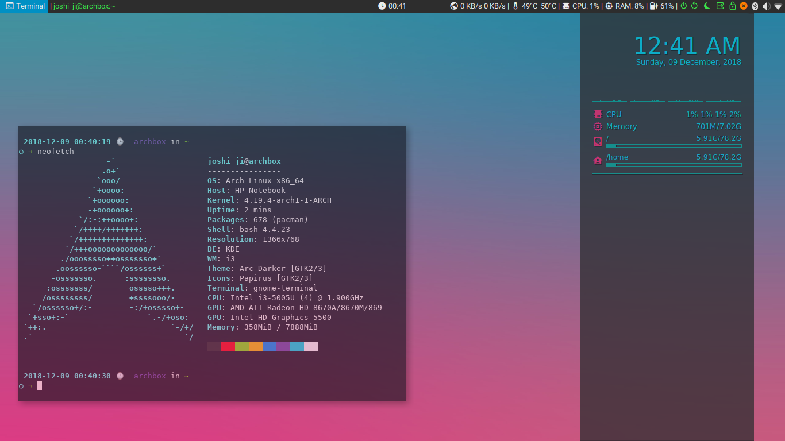

# Old dotfiles

These dotfiles are of time when I am just getting started with arch linux. They might be messy and not organised. So beware :-P

## Screenshots

<h4 align=center>
   
  Neofetch  
   
  Greeter testing :-D   
   
  Same with neofetch but this time with power menu on polybar (see top-right)
</h4>